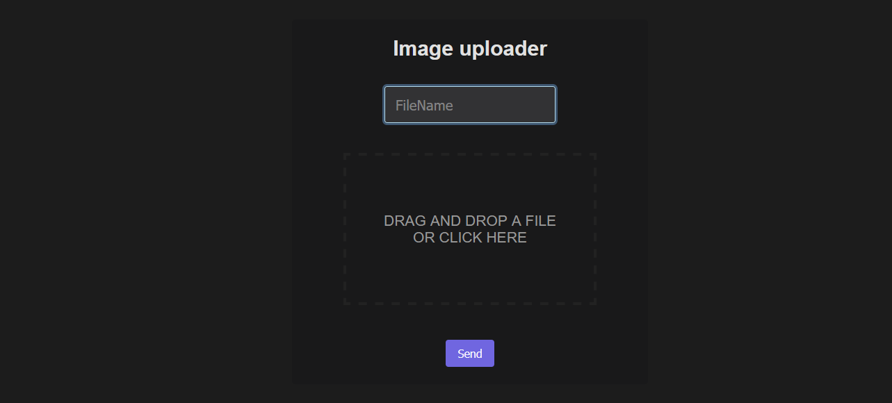

# ImageUploader Popup



### Sample backend (PHP)
```php
// upload.php

<?php
$namef = $_POST['fname'];
$filename = $_FILES['file']['name'];
$location = "upload/".$namef;


if ( move_uploaded_file($_FILES['file']['tmp_name'], $location) ) { 
  echo $namef; 
} else { 
  echo 'Failure'; 
}
?>
```
